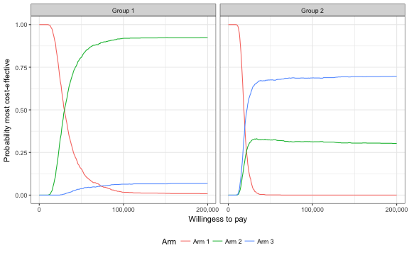
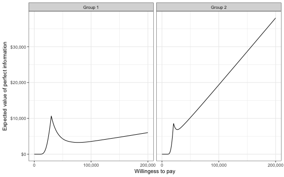
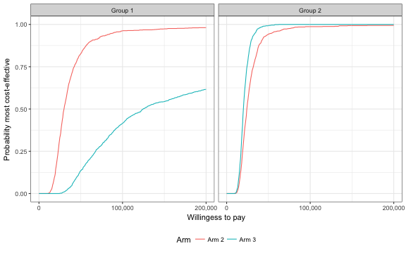
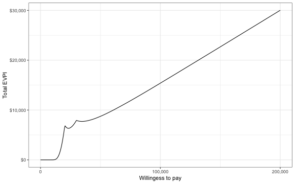

# Overview
Personalized cost-effectiveness analysis (pCEA) evaluates the cost-effectiveness of treatments at the individual (or subgroup) level. This has two major implications:

* Optimal treatments will vary across patients.
* Treatments will be more cost-effective for some patients than others.

The `hesim` package help facilitate pCEA by providing a number of functions for analyzing subugroup level health and cost outcomes from simulation models that quantify parameter uncertainty using probabilistic sensitivity analysis (PSA). These functions take simulation output and generate measures commonly used for technology assessment including:

* net benefits.
* incremental cost-effectiveness ratios (ICERs).
* cost-effectivenss acceptability curves (CEACs).
* the expected value of perfect information (EVPI).

The rest of this document provides an overview of pCEA and how it can be conducted using `hesim`. The perspective is Bayesian in nature, in that it is concerned with estimating the entire distribution of outcomes rather than just expected values [@baio2012bayesian; @baio2015probabilistic]. It also stresses that both optimal treatments and the cost-effectiveness of those treatments vary accross individuals [@basu2007value; @espinoza2014value].

# Net Benefits
Decision analysis provides a formal framework for making treatment decisions based on the utility that a therapy provides to a patient population. Traditionally, the optimal treatment arm is the one that maximizes expected net benefits. The expected net benefit is calculated by averaging over the patient population and uncertain parameters $\theta$. For a given subgroup $g$ and parameter set $\theta$, these net benefits are computed as the difference between the monetized health gains from an intervention less costs, or,

$$
\begin{aligned}
NB_g(j,\theta) = e_{gj}\cdot k- c_{gj},
\end{aligned}
$$

where $e_{gj}$ and $c_{gj}$ are measures of clinical effectiveness (e.g. QALYs) and costs in subgroup $g$ using treatment $j$ respectively, and $k$ is a decision makers willingness to pay per unit of clinical effectiveness. The optimal treatment for a given subgroup is the one that maximizes expected net benefits,

$$
\begin{aligned}
j^{*}_g = \text{argmax}_j E_{\theta} \left[NB_g(j,\theta)\right].
\end{aligned}
$$

In practice, new interventions are usually compared to a standard treatment often referred to as the comparator. In these cases, a new treatment in a given subgroup is preferred to the comparator if the expected incremental net benefit of the new treatment is positive; that is, treatment 1 is preferred to treatment 0 in subgroup $g$ if $EINB_g > 0$ where the incremental net benefit (INB) is given by

$$
\begin{aligned}
INB_g = NB_g(j = 1, \theta)] - NB_g(j = 0, \theta),
\end{aligned}
$$
and $EINB_g =E_\theta \left[INB_g\right]$. Equivalently, treatment $1$ is preferred to treatment $0$ in subgroup $g$ if the incremental cost-effectiveness ratio (ICER) is greater than the willingness to pay $k$,

$$
\begin{aligned}
k > \frac{c_{g1} - c_{s0}}{e_{g1} - e_{g0}} = ICER_g.
\end{aligned}
$$


# Probabilistic sensitivity analysis
Expected net benefits are based entirely on expected values and ignore parameter uncertainty. This implies that net benefits are uncertain and that optimal treatment arms may be selected incorrectly. This uncertainty can be quantified using PSA, which uses Bayesian and quasi-Bayesian techniques to estimate the distribution of net benefits given the distribution of the parameters for each treatment arm.

Since the joint distribution of the model parameters cannot be derived analytically (except in the simplest cases), the distribution of $\theta$ is approximated by simulating the parameters from their joint posterior distribution and calculating relevant quantities of interest as a function of the simulated parameters. For each treatment arm and subgroup, PSA therefore produces $n$ random draws from the posterior distribution of clinical effectiveness and costs,

$$
\begin{aligned}
e_{gj} &= [e_{gj}^1, e_{gj}^2, \dots, e_{gj}^n] \\
c_{gj} &= [c_{gj}^1, c_{gj}^2, \dots, c_{gj}^n].
\end{aligned}
$$

Below we simulate costs and QALYs for three treatment arms and two subgroups (in a real world analysis, this output would be derived from a detailed health-economic simulation model). Arm 1 is the current standard of care; it is the cheapest therapy, but also the least efficacious. Arms 2 and 3 are equally costly, but Arm 2 is more effective in subgroup 1 while Arm 3 is more effective in subgroup 2. 


```r
nsims <- 1000

# cost
c <- vector(mode = "list", length = 6)
names(c) <- c("Arm 1, Grp 1", "Arm 1, Grp 2", "Arm 2, Grp 1",
              "Arm 2, Grp 2", "Arm 3, Grp 1", "Arm 3, Grp 2")
c[[1]] <- rlnorm(nsims, 2, .1)
c[[2]] <- rlnorm(nsims, 2, .1)
c[[3]] <- rlnorm(nsims, 11, .15)
c[[4]] <- rlnorm(nsims, 11, .15)
c[[5]] <- rlnorm(nsims, 11, .15)
c[[6]] <- rlnorm(nsims, 11, .15)

# effectiveness
e <- c
e[[1]] <- rnorm(nsims, 8, .2)
e[[2]] <- rnorm(nsims, 8, .2)
e[[3]] <- rnorm(nsims, 10, .8)
e[[4]] <- rnorm(nsims, 10.5, .8)
e[[5]] <- rnorm(nsims, 8.5, .6)
e[[6]] <- rnorm(nsims, 11, .6)

# cost and effectiveness by arm and simulation
library("data.table")
ce <- data.table(sim = rep(seq(nsims), length(e)),
                             arm = rep(paste0("Arm ", seq(1, 3)), 
                                       each = nsims * 2),
                             grp = rep(rep(c("Group 1", "Group 2"),
                                           each = nsims), 3),
                             cost = do.call("c", c), qalys = do.call("c", e))
head(ce)
```

```
##    sim   arm     grp     cost    qalys
## 1:   1 Arm 1 Group 1 6.664810 7.820935
## 2:   2 Arm 1 Group 1 7.682041 7.925464
## 3:   3 Arm 1 Group 1 6.575257 8.025834
## 4:   4 Arm 1 Group 1 8.778169 8.161978
## 5:   5 Arm 1 Group 1 7.029168 7.653727
## 6:   6 Arm 1 Group 1 7.835880 8.289239
```

For any given willingness to pay $k$, expected net benefits can be calculated by arm, subgroup, and simulation number. For example, with $k=150,000$, a reasonable estimate of the value of a life-year in the United States, Arm 2 provides the most expected net benefits in subgroup 2 while Arm 3 provides the most expected net benefits in subgroup 2.


```r
ce[, nb := 150000 * qalys - cost]
enb <- ce[, .(enb = mean(nb)), by = c("arm", "grp")]
enb <- dcast(enb, arm ~ grp, value.var = "enb")
print(enb)
```

```
##      arm Group 1 Group 2
## 1: Arm 1 1199149 1200064
## 2: Arm 2 1442530 1511720
## 3: Arm 3 1211237 1585747
```

A number of measures have been proposed in the health economics literature to summarize the uncertainty estimated using PSA. Below we describe the most common measures, which are estimated using the functions `psa` and `psa_pw`. The `psa` function summarizes results by taking into account each treatment arm in the analysis, while the function `psa_pw` summarizes "pairwise" results in which each treatment is compared to a comparator. 

We can use the  `psa` function to summarize results from our `data.table` object of simulated output for a range of willingness to pay values,


```r
library("hesim")
ktop <- 200000
psa.dt <-  psa(ce, k = seq(0, ktop, 500), sim = "sim", arm = "arm",
              grp = "grp", e = "qalys", c = "cost")
```

The most important input in `psa` is the `data.table` object (`x`) containing columns for simulation number (`sim`), treatment arm (`arm`), subgroup (`grp`), clinical effectiveness (`e`), and costs (`c`). Users specify the names of the relevant columns in their output table as strings. The other relevant parameter is $k$, which is a range of willingness to pay values to use for estimating net benefits. 

Likewise, we can use `psa_pw` to summarize the PSA when directly comparing the two treatment arms (Arm 2 and Arm 3) to the comparator (Arm 1). 


```r
psa.pw.dt <-  psa_pw(ce,  k = seq(0, ktop, 500), control = "Arm 1",
                     sim = "sim", arm = "arm", e = "qalys", c = "cost")
```

The same inputs are used as in `psa` except users must specify the name of the control arm. 

## Probability most cost-effective
A useful summary measure for quantifying uncertainty is the probability that each treatment arm is the most cost effective. For a particular subgroup, this is estimated from simulation output as the proportion of simulation draws that each arm has the highest net benefits. For example, consider a random sample of 10 draws from the PSA simulation output and suppose $k$ is again equal to $150,000$. 


```r
library("knitr")
ce.nb <- dcast(ce[sim %in% sample(1:nsims, 10) & grp == "Group 2"], 
               sim ~ arm, value.var = "nb")
setnames(ce.nb, colnames(ce.nb), c("sim", "nb1", "nb2", "nb3"))
ce.nb[, maxj := apply(ce.nb[, .(nb1, nb2, nb3)], 1, which.max)]
ce.nb[, maxj := factor(maxj, levels = c(1, 2, 3))]
```


| sim|     nb1|     nb2|     nb3|maxj |
|---:|-------:|-------:|-------:|:----|
| 125| 1213574| 1368045| 1720653|3    |
| 207| 1158761| 1641988| 1518814|2    |
| 237| 1182783| 1473864| 1525099|3    |
| 293| 1180710| 1515334| 1549269|3    |
| 324| 1185359| 1340282| 1578166|3    |
| 375| 1213721| 1615533| 1752345|3    |
| 516| 1244545| 1614629| 1376695|2    |
| 527| 1215112| 1625519| 1522945|2    |
| 843| 1231421| 1505393| 1517060|3    |
| 907| 1182739| 1446206| 1615531|3    |

```r
mce <- prop.table(table(ce.nb$maxj))
print(mce)
```

```
## 
##   1   2   3 
## 0.0 0.3 0.7
```

In this example, treatments 1, 2, and 3 have the highest net benefits a fraction 0, 0.3, and 0.7 of the time respectively. The `psa` function performs this same calculations for a range of values of $k$ and all `nsims` random draws of the simulation output. The output is a tidy `data.table` which facilitates plotting with `ggplot`.

MCE plot

```r
library("ggplot2")
library("scales")
theme_set(theme_bw())
ggplot(psa.dt$mce, aes(x = k, y = prob, col = factor(arm))) +
  geom_line() + facet_wrap(~grp) + xlab("Willingess to pay") +
  ylab("Probability most cost-effective") +
  scale_x_continuous(breaks = seq(0, ktop, 100000), label = comma) +
  theme(legend.position = "bottom") + scale_colour_discrete(name = "Arm")
```



In group 1, Arm 2 provides the greatest net benefits with high probability for almost all reasonable values of k. In group 2, the results are less certain, although Arm 3 provides the greatest net benefits with a higher probability than Arm 2. 

## Value of perfect information
One draw back of the previous measure is that it ignores the magnitude of cost or QALY gains. A measure which combines the probability of being most effective with the magnitude of the expected net benefit is the expected value of perfect information (EVPI). Intuitively, the EVPI provides an estimate of the amount that a decision maker would be willing to pay to collect additional data and completely eliminate uncertainty. Mathematically, the EVPI is defined as the difference between the maximum expected net benefit given perfect information and the maximum expected net benefit given current information. In other words, we calculate the net benefit for the optimal treatment arm for each random draw of the parameters and compare that to the net benefit for the treatment arm that is optimal when averaging across all parameters, 

$$
\begin{aligned}
EVPI &= \int_\theta NB_s(j_s^{*}, \theta^s) - NB_s(j_s^{*}, \theta). \\
\end{aligned}
$$

To illustrate consider the same random sample of 10 draws from our simulation output used above.


```r
armmax.g2 <- which.max(enb[[3]])
ce.nb[, nbpi := apply(ce.nb[, .(nb1, nb2, nb3)], 1, max)]
ce.nb[, nbci := ce.nb[[armmax.g2 + 1]]]
kable(ce.nb, digits = 0)
```


| sim|     nb1|     nb2|     nb3|maxj |    nbpi|    nbci|
|---:|-------:|-------:|-------:|:----|-------:|-------:|
| 125| 1213574| 1368045| 1720653|3    | 1720653| 1720653|
| 207| 1158761| 1641988| 1518814|2    | 1641988| 1518814|
| 237| 1182783| 1473864| 1525099|3    | 1525099| 1525099|
| 293| 1180710| 1515334| 1549269|3    | 1549269| 1549269|
| 324| 1185359| 1340282| 1578166|3    | 1578166| 1578166|
| 375| 1213721| 1615533| 1752345|3    | 1752345| 1752345|
| 516| 1244545| 1614629| 1376695|2    | 1614629| 1376695|
| 527| 1215112| 1625519| 1522945|2    | 1625519| 1522945|
| 843| 1231421| 1505393| 1517060|3    | 1517060| 1517060|
| 907| 1182739| 1446206| 1615531|3    | 1615531| 1615531|

To calculate EVPI, we average net benefits given current information and net benefits given perfect information accross simulation draws. 


```r
enbpi <- mean(ce.nb$nbpi)
enbci <- mean(ce.nb$nbci)
print(enbpi)
```

```
## [1] 1614026
```

```r
print(enbci)
```

```
## [1] 1567658
```

```r
print(enbpi - enbci)
```

```
## [1] 46368.23
```

The `psa` function peforms this same calculation accross all simulation draws from the PSA and for a number of values of willingess to pay values $k$. A plot by group of the the EVPI for different values of $k$ is shown below. The kinks in the plot represent values of $k$ where the optimal arm changes.


```r
ggplot(psa.dt$evpi, aes(x = k, y = evpi)) +
  geom_line() + facet_wrap(~grp) + xlab("Willingess to pay") +
  ylab("Expected value of perfect information") +
  scale_x_continuous(breaks = seq(0, ktop, 100000), label = comma) +
  scale_y_continuous(label = scales::dollar) +
  theme(legend.position = "bottom") + scale_colour_discrete(name = "Arm")
```



## Distribution of health and cost outcomes

```r
ce[, lys := qalys * 1.5]
cea.fun <- function(x) list(mean = mean(x), quant = quantile(x, c(.025, .975)))
psa.custom.dt <- psa(ce, k = seq(0, ktop, 500), sim = "sim", arm = "arm",
               grp = "grp", e = "qalys", c = "cost",
               custom_vars = c("cost", "lys", "qalys"), 
               custom_fun = cea.fun)
```


```r
psa.custom.dt$summary
```

```
##      arm     grp qalys_mean qalys_lower qalys_upper    cost_mean
## 1: Arm 1 Group 1   7.994374    7.610600    8.367031     7.428280
## 2: Arm 2 Group 1  10.022049    8.526102   11.721826 60777.529178
## 3: Arm 3 Group 1   8.479425    7.296292    9.642077 60676.281955
## 4: Arm 1 Group 2   8.000476    7.612433    8.412154     7.413777
## 5: Arm 2 Group 2  10.479210    8.936330   12.006886 60161.412984
## 6: Arm 3 Group 2  10.974074    9.794607   12.156132 60363.588116
##      cost_lower   cost_upper
## 1:     6.123782     8.951935
## 2: 45303.803821 80155.805175
## 3: 44862.898665 80988.586143
## 4:     6.084665     8.843786
## 5: 45425.506516 78853.242784
## 6: 44855.818875 80270.758009
```


```r
psa.custom.dt$custom.table
```

```
##      arm     grp    cost.mean cost.quant.2.5% cost.quant.97.5% lys.mean
## 1: Arm 1 Group 1     7.428280        6.123782         8.951935 11.99156
## 2: Arm 2 Group 1 60777.529178    45303.803821     80155.805175 15.03307
## 3: Arm 3 Group 1 60676.281955    44862.898665     80988.586143 12.71914
## 4: Arm 1 Group 2     7.413777        6.084665         8.843786 12.00071
## 5: Arm 2 Group 2 60161.412984    45425.506516     78853.242784 15.71882
## 6: Arm 3 Group 2 60363.588116    44855.818875     80270.758009 16.46111
##    lys.quant.2.5% lys.quant.97.5% qalys.mean qalys.quant.2.5%
## 1:       11.41590        12.55055   7.994374         7.610600
## 2:       12.78915        17.58274  10.022049         8.526102
## 3:       10.94444        14.46312   8.479425         7.296292
## 4:       11.41865        12.61823   8.000476         7.612433
## 5:       13.40449        18.01033  10.479210         8.936330
## 6:       14.69191        18.23420  10.974074         9.794607
##    qalys.quant.97.5%
## 1:          8.367031
## 2:         11.721826
## 3:          9.642077
## 4:          8.412154
## 5:         12.006886
## 6:         12.156132
```

## Cost-effectiveness plane
The cost-effectivenss plane plots the incremental effectivenss of a treatment arm (relative to a comparator) against the incremental cost of the treatment arm. The plot is useful because it demonstrates both the uncertainty and the magnitutde of the estimates. Each point on the plot is from a particular random draw from the PSA.  

Data for plotting a cost-effectiveness plane comes from the `delta` output generated from the `psa_pw` function, which, for each sampled parameter set, estimtes incremental differences in costs, clinical effectivenss, and any other variables specifies in `custom_vars` relative to the comparator. The dotted line in the plot is the willingess to pay line, with slope equal to the value of $k$. For a given $k$, points below the line are cost-effective while those above are not. 


```r
head(psa.pw.dt$delta)
```

```
##    sim   arm     grp   iqalys    icost
## 1:   1 Arm 2 Group 1 2.790906 44723.35
## 2:   2 Arm 2 Group 1 1.046514 48693.92
## 3:   3 Arm 2 Group 1 2.915151 63259.79
## 4:   4 Arm 2 Group 1 3.201652 58907.29
## 5:   5 Arm 2 Group 1 3.161476 58932.37
## 6:   6 Arm 2 Group 1 0.355801 53341.90
```

```r
ylim <- max(psa.pw.dt$delta[, icost]) * 1.1
xlim <- ceiling(max(psa.pw.dt$delta[, iqalys]) * 1.1)
ggplot(psa.pw.dt$delta, aes(x = iqalys, y = icost, col = factor(arm))) + 
  geom_jitter(size = .5) + facet_wrap(~grp) + 
  xlab("Incremental QALYs") + ylab("Incremental cost") +
  scale_y_continuous(label = dollar, limits = c(-ylim, ylim)) +
  scale_x_continuous(limits = c(-xlim, xlim), breaks = seq(-6, 6, 2)) +
  theme(legend.position = "bottom") + scale_colour_discrete(name = "Arm") +
  geom_abline(slope = 150000, linetype = "dashed") +
  geom_hline(yintercept = 0) + geom_vline(xintercept = 0)
```


## Cost-effectiveness acceptability curve (CEAC)
The cost-effectivenss acceptability curve (CEAC) is similar to the MCE plot. The difference is that the CEAC compares each arm to a single comparator wheras the MCE plot considers all arms simultaneously. Output to produce a CEAC is generated from the `psa_pw` function.

The plot shows that, in subgroup 1, Arm 2 has large net benefits than Arm 1 with very high probability for reasonable values of $k$. Arm 3 also has higher net benefits than Arm 1 with probability over 1/2 for values of $k$ larger than 125,000. In group 2, both Arm 2 and Arm 3 have higher net benefits than Arm 1 for almost all values of $k$, although this probability is larger form Arm 2 than Arm 3 when $k$ is smaller.


```r
ggplot(psa.pw.dt$ceac, aes(x = k, y = prob, col = factor(arm))) +
  geom_line() + facet_wrap(~grp) + xlab("Willingess to pay") +
  ylab("Probability most cost-effective") +
  scale_x_continuous(breaks = seq(0, ktop, 100000), label = comma) +
  theme(legend.position = "bottom") + scale_colour_discrete(name = "Arm")
```



## Credible intervals for incremental costs and effectiveness
`psa_pw` contains summary output with expected costs and expected efficacy as well as their respective 95% credible intervals. The table also contains the ICER, which is equal to expected costs divided by the measure of expected efficacy.  


```r
print(psa.pw.dt$summary)
```

```
##      arm     grp iqalys_mean iqalys_lower iqalys_upper icost_mean
## 1: Arm 2 Group 1   2.0276751    0.3832463     3.751605   60770.10
## 2: Arm 3 Group 1   0.4850511   -0.7402345     1.763711   60668.85
## 3: Arm 2 Group 2   2.4787339    0.8820320     3.952615   60154.00
## 4: Arm 3 Group 2   2.9735973    1.7423648     4.244154   60356.17
##    icost_lower icost_upper      icer
## 1:    45295.86    80148.61  29970.33
## 2:    44855.68    80980.85 125077.25
## 3:    45417.86    78845.89  24268.03
## 4:    44848.70    80263.87  20297.36
```

If the user would like to examine the distribution of outcomes other than those specified this summary table, then they can also generate a custom table of summary output. The custom table can contain any quantities of interest (QOIs) as long as they are specified in addition to the `sim`, `arm`, `e`, and `c` columns in the posterior distribution data table. The default is to estimate means, the 2.5% quantile, and the 97.5% quantile for each variable, but any custom function can used. Below, we create a hypothetical variable for life-years and create table summarizing our estimates of costs, QALYs and life-years. A custom function, identical to the default option, is entered into the function for illustrative purposes.


```r
ce[, lys := qalys * 1.5]
cea.fun <- function(x) list(mean = mean(x), quant = quantile(x, c(.025, .975)))
psa.custom.dt <- psa(ce, k = seq(0, ktop, 500), sim = "sim", arm = "arm",
               grp = "grp", e = "qalys", c = "cost",
               custom_vars = c("cost", "lys", "qalys"), 
               custom_fun = cea.fun)
```


```r
psa.custom.dt$custom.table
```

```
##      arm     grp    cost.mean cost.quant.2.5% cost.quant.97.5% lys.mean
## 1: Arm 1 Group 1     7.428280        6.123782         8.951935 11.99156
## 2: Arm 2 Group 1 60777.529178    45303.803821     80155.805175 15.03307
## 3: Arm 3 Group 1 60676.281955    44862.898665     80988.586143 12.71914
## 4: Arm 1 Group 2     7.413777        6.084665         8.843786 12.00071
## 5: Arm 2 Group 2 60161.412984    45425.506516     78853.242784 15.71882
## 6: Arm 3 Group 2 60363.588116    44855.818875     80270.758009 16.46111
##    lys.quant.2.5% lys.quant.97.5% qalys.mean qalys.quant.2.5%
## 1:       11.41590        12.55055   7.994374         7.610600
## 2:       12.78915        17.58274  10.022049         8.526102
## 3:       10.94444        14.46312   8.479425         7.296292
## 4:       11.41865        12.61823   8.000476         7.612433
## 5:       13.40449        18.01033  10.479210         8.936330
## 6:       14.69191        18.23420  10.974074         9.794607
##    qalys.quant.97.5%
## 1:          8.367031
## 2:         11.721826
## 3:          9.642077
## 4:          8.412154
## 5:         12.006886
## 6:         12.156132
```

# Value of personalized care
The previous analyses allow net benefits and optimal treatment decisions to vary by subgroup. In contrast, most CEAs estimate the treatment, $j^{*}$, that is optimal when averaging net benefits over the entire population. In particular, if the population is broken up into $G$ distinct subgroups, the optimal treatment is given by,

$$
\begin{aligned}
j^{*} = \text{argmax}_j \sum_{g=1}^{G} w_g E_{\theta}\left[NB_g(j,\theta)\right],
\end{aligned}
$$

@basu2007value have shown that selecting subgroup specific treatments increases expected net benefits relative to this one-size fits all approach. They refer to additional net benefit as the expected value of individualized care (EPIC), which can be computed in using the subgroup approach illustrated here as,

$$
\begin{aligned}
\sum_{g=1}^G w_g E_{\theta}\left[NB_g(j^{*}_s,\theta)\right] - \sum_{g=1}^G w_g  E_{\theta}\left[NB_g(j^{*},\theta)\right],
\end{aligned}
$$

where $w_g \in (0, 1)$ is a weight denoting that proportion of the population represented by subgroup $g$ and $\sum_{g=1}^{G} w_g = 1$. We can use `hesim` to demonstrate the value of individualized care.


```r
w.dt <- data.table(grp = paste0("Group ", seq(1, 2)), w = c(0.25, .75))
evpi <- psa.dt$evpi
evpi <- merge(evpi, w.dt, by = "grp")
totevpi <- evpi[,lapply(.SD, weighted.mean, w = w),
                by = "k", .SDcols = c("evpi")]
ggplot(totevpi, aes(x = k, y = evpi)) +
  geom_line() + xlab("Willingess to pay") +
  ylab("Total EVPI") +
  scale_x_continuous(breaks = seq(0, ktop, 100000), label = comma) +
  scale_y_continuous(label = scales::dollar) +
  theme(legend.position = "bottom") + scale_colour_discrete(name = "Arm")
```




```r
ce <- merge(ce, w.dt, by = "grp")
totenb <- ce[, .(totenb = weighted.mean(nb, w = w)), by = c("arm")]
```


```r
ptenb.grp.max <- apply(as.matrix(enb[, -1]), 2, max)
ptenb.max <- sum(ptenb.grp.max * w.dt$w)
tenb.max <- max(totenb$totenb)
tnb <- c(ptenb.max, tenb.max)
names(tnb) <- c("Personalized total TENB", "One-size fits all TENB")
```


```r
evic <- tnb[1] - tnb[2]
names(evic) <- "EVIC"
print(evic)
```

```
##    EVIC 
## 55520.5
```

```r
print(evic/150000)
```

```
##      EVIC 
## 0.3701367
```

Our estimate of the EVIC is \$55,520, or in terms of net health benefits, 0.37 QALYs. 

# References

