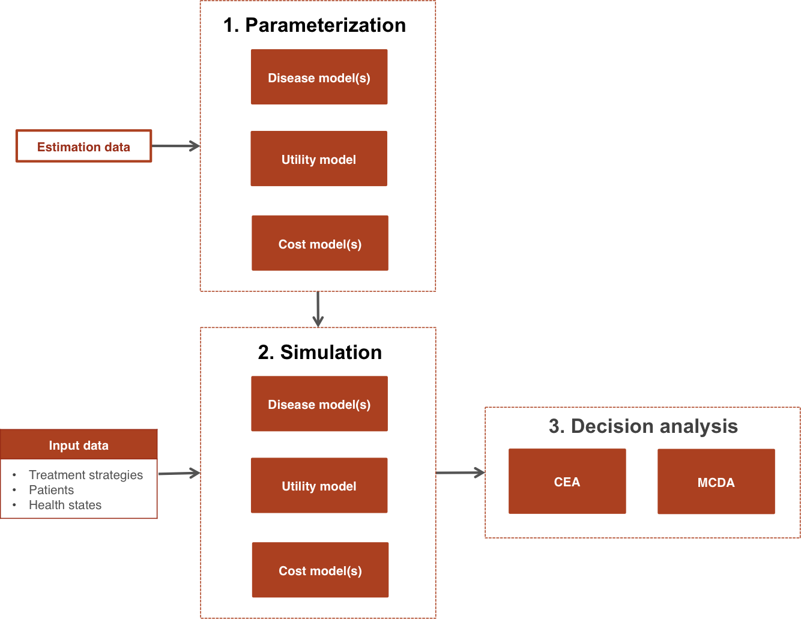

# Overview
`hesim` supports three types of health-economic models: (i) cohort discrete time state transition models (cDTSTMs), (ii) N-state partitioned survival models (PSMs), and (iii) individual-level continuous time state transition models (iCTSTMs). cDTSTMs are Markov cohort models and can be time-homogeneous or time-inhomogeneous. iCTSTMs are individual-level simulations that can encompass both Markov and semi-Markov processes. All models are implemented as [R6](https://r6.r-lib.org/index.html) classes and have methods for simulating disease progression, costs, and QALYs.

```{r  echo = FALSE, message = FALSE, warning = FALSE}
library("kableExtra")
psm <- c("N-state partitioned survival model (PSM)", "`hesim::Psm`")
cdtstm <- c("Cohort discrete time state transition model (cDTSTM)", "`hesim::CohortDtstm`")
ictstm <- c("Individual-level continuous time state transition model (iCTSTM)", "`hesim::IndivCtstm`")
tbl <- rbind(psm, cdtstm, ictstm)
colnames(tbl) <- c("Economic model", "R6 class")
knitr::kable(tbl, row.names = FALSE)  %>% # Pipe imported from kableExtra
  kableExtra::kable_styling()
```

Economic models can, in general, be created in two ways: first, with mathematical expressions using non-standard evaluation (note that this is currently only available for cDTSTMs), and, second, from specific statistical models. Each economic model consists of statistical models of disease progression, costs, and utilities. As shown in the figure, a typical analysis proceeds in a 3-step process:

<br>
```{r, out.width = "600px", echo = FALSE}

```
<br>
<br>

1. **Parameterization**: An economic model is parameterized by estimating statistical models for disease progression, costs, and utilities using "estimation" datasets, such as extracted data from published studies for a meta-analysis or multi-state survival data from a clinical trial. 
2. **Simulation**: The statistical models estimated in Step 1 are combined to construct an economic model. For a given model structure, disease progression, QALYs, and costs are simulated from "input data", based on the target population and treatment strategies of interest.
3. **Decision analysis**: Simulated outcomes from Step 2 are used to perform decision analysis using approaches such as [cost-effectiveness analysis (CEA)](https://en.wikipedia.org/wiki/Cost-effectiveness_analysis) and [multi-criteria decision analysis (MCDA)](https://en.wikipedia.org/wiki/Multiple-criteria_decision_analysis). 

The entire analysis is inherently Bayesian, as uncertainty in the parameters from the statistical models is propagated throughout the economic model and decision analysis with probabilistic sensitivity analysis (PSA). Furthermore, since the statistical and economic models are integrated, patient heterogeneity can be easily introduced with patient level covariates.

# Treatment strategies, target population, and model structure
Before beginning an analysis, it is necessary to define the treatment strategies of interest, the target population, and the model structure. This can be done in `hesim` by creating a `hesim_data` object with the function `hesim_data()`. Let's consider an example where we use an iCTSTM to evaluate two competing treatment strategies. We will consider a model with three health states (*healthy*, *sick*, and *dead*) with four transitions (*healthy -> sick*, *sick -> healthy*, *healthy -> dead*, and *sick -> dead*). Since we are using an individual-level model, we must simulate a target population that is sufficiently large so that uncertainty reflects uncertainty in the model parameters, rather than variability across simulated individuals. 

```{r warning = FALSE, message = FALSE}
library("hesim")
library("data.table")
strategies <- data.table(strategy_id = c(1, 2))
n_patients <- 1000
patients <- data.table(patient_id = 1:n_patients,
                          age = rnorm(n_patients, mean = 45, sd = 7),
                          female = rbinom(n_patients, size = 1, prob = .51))
states <- data.table(state_id = c(1, 2),
                     state_name = c("Healthy", "Sick")) # Non-death health states
tmat <- rbind(c(NA, 1, 2),
              c(3, NA, 4),
              c(NA, NA, NA))
colnames(tmat) <- rownames(tmat) <- c("Healthy", "Sick", "Dead")
transitions <- create_trans_dt(tmat)
transitions[, trans := factor(transition_id)]
hesim_dat <- hesim_data(strategies = strategies,
                        patients = patients, 
                        states = states,
                        transitions = transitions)
print(hesim_dat)
```

# Parameterization
## Disease progression
As shown in the table below, the statistical model used to parameterize the disease model component of an economic model varies by the type of economic model. For example, multinomial logistic regressions can be used to parameterize a cDTSTM, a set of *N-1* independent survival models are used to parameterize an *N*-state partitioned survival model, and multi-state models can be used to parameterize an iCTSTM. 

```{r  echo = FALSE, message = FALSE, warning = FALSE}
tbl <- rbind(
  c("`hesim::CohortDtstm`",
    "Custom", 
    "`hesim::tparams_transprobs`", 
    "`hesim::define_model()`"),
  c("`hesim::CohortDtstm`", 
    "Multinomial logistic regressions",
    "`hesim::params_mlogit_list`",
    "`hesim::multinom_list`"),
  c("`hesim::Psm`", 
    "Independent survival models", 
    "`hesim::params_surv_list`", 
    "`hesim::flexsurvreg_list`"),
  c("`hesim::IndivCtstm`", 
    "Multi-state model (joint likelihood)", 
    "`hesim::params_surv`", 
    "`flexsurv::flexsurvreg`"),
  c("`hesim::IndivCtstm`", 
    "Multi-state model (transition-specific)", 
    "`hesim::params_surv_list`", 
    "`hesim::flexsurvreg_list`")  
)
colnames(tbl) <- c("Economic model (R6 class)", "Statistical model", 
                   "Parameter object", "Model fit object")
knitr::kable(tbl, row.names = FALSE) %>%
  kableExtra::kable_styling() %>%
  kableExtra::collapse_rows(columns = 1, valign = "top")
```

Disease models can either be fit from an explicit statistical model or through mathematical expressions. In the first case, the easiest way to parameterize a disease model is by fitting a statistical model using `R`. For example, survival models and multi-state models can be fit using `flexsurv::flexsurvreg()` while multinomial logistic regressions can be fit with `nnet::multinom()`. In other cases, the disease models will not be fit directly with `R`, but the estimates of a disease model can be directly stored in parameter (`hesim::params`) or transformed parameter (`hesim::tparams`) objects. In the second case, an entire model (encompassing disease progression, costs, and utility) can be defined in terms of mathematical expressions with `hesim::define_model()`.

We will illustrate an example of a statistical model of disease progression fit with `R` by estimating a multi-state model with a joint likelihood using `flexsurv::flexsurvreg()`.

```{r, message = FALSE, warning = FALSE}
library("flexsurv")
mstate_data <- data.table(mstate3_exdata$transitions)
mstate_data[, trans := factor(trans)]
fit_wei <- flexsurv::flexsurvreg(Surv(years, status) ~ trans + 
                                                       factor(strategy_id):trans +
                                                       age:trans + 
                                                       female: trans +
                                                       shape(trans), 
                                 data = mstate_data, 
                                 dist = "weibull")
```

## Costs and utility
Costs and utilities can currently either be modeled using a linear model or using predicted means. The latter is an example of a transformed parameter object since the predicted means are parameters that are presumably a function of the underlying parameters of a statistical model and possibly input data.

```{r  echo = FALSE, message = FALSE, warning = FALSE}
tbl <- rbind(
  c("Predicted means", 
    "`hesim::tparams_mean`", 
    "`hesim::stateval_tbl`"),
  c("Predicted means", 
    "`hesim::tparams_mean`", 
    "`hesim::define_model()`"),
  c("Linear model", 
    "`hesim::params_lm`", 
    "`stats::lm`")
)
colnames(tbl) <- c("Statistical model", "Parameter object", "Model fit object")
knitr::kable(tbl, row.names = FALSE) %>%
  kableExtra::kable_styling() %>%
    kableExtra::collapse_rows(columns = 1, valign = "top")
```

Linear models are fit using `stats::lm()`. Predicted means can be constructed from a `hesim::stateval_tbl` object or as a part of a model defined in term of mathematical expressions with `define_model()`. The former is a special object used to assign values to health states that can vary across treatment strategies, patients, and/or time intervals. State values can be specified either as moments (i.e., mean and standard error) or parameters (e.g., shape and scale of gamma distribution) of a probability distribution, or by pre-simulating values from a suitable probability distribution. Here we will use `hesim::stateval_tbl` objects for utility and two cost categories (drug and medical).

```{r}
# Utility
utility_tbl <- stateval_tbl(data.table(state_id = states$state_id,
                                       mean = mstate3_exdata$utility$mean,
                                       se = mstate3_exdata$utility$se),
                            dist = "beta",
                            hesim_data = hesim_dat)

# Costs
drugcost_tbl <- stateval_tbl(data.table(strategy_id = strategies$strategy_id,
                                       est = mstate3_exdata$costs$drugs$costs),
                            dist = "fixed",
                            hesim_data = hesim_dat) 
medcost_tbl <- stateval_tbl(data.table(state_id = states$state_id,
                                       mean = mstate3_exdata$costs$medical$mean,
                                       se = mstate3_exdata$costs$medical$se),
                            dist = "gamma",
                            hesim_data = hesim_dat)  
```
 
# Simulation
## Constructing an economic model
An economic model consists of a disease model, a utility model, and a set of cost models for each cost category. The utility and cost models are always `hesim::StateVals` objects, whereas the disease models vary by economic model. The disease model is used to simulate survival curves in a PSM and health state transitions in a cDTSTM and iCTSTM.

```{r  echo = FALSE, message = FALSE, warning = FALSE}
dtstm <- c("`hesim::CohortDtstm`", "`hesim::CohortDtstmTrans`",
         "`hesim::StateVals`", "`hesim::StateVals`")
psm <- c("`hesim::Psm`", "`hesim::PsmCurves`",
         "`hesim::StateVals`", "`hesim::StateVals`")
ictstm <- c("`hesim::IndivCtstm`", "`hesim::IndivCtstmTrans`",
         "`hesim::StateVals`", "`hesim::StateVals`")
tbl <- rbind(dtstm, psm, ictstm)
colnames(tbl) <- c("Economic model", "Disease model", "Utility model", "Cost model(s)")
knitr::kable(tbl, row.names = FALSE) %>%
  kableExtra::kable_styling()
```

Since economic models in `hesim` are inherently Bayesian, we must specify the number of parameter samples we will use for the PSA before constructing the model. 

```{r}
n_samples <- 1000
```

### Disease model
Models are constructed as a function of parameters (or model fits) and in regression models, input data. The input data must be objects of class `expanded_hesim_data`, which are [data tables](https://github.com/Rdatatable/data.table/wiki) containing the covariates for the statistical model. In our multi-state model, each row is a unique treatment strategy, patient, and health-state transition. The ID variables (`strategy_id`, `patient_id`, and `transition_id`) are stored as attributes of the dataset.

An `expanded_hesim_data` object can be created directly or by expanding an object of class `hesim_data` using `expand.hesim_data()`. Here, we will use the latter approach,

```{r warning = FALSE, message = FALSE}
transmod_data <- expand(hesim_dat, 
                        by = c("strategies", "patients", "transitions"))
head(transmod_data)
attr(transmod_data, "id_vars")
```

We can now construct the health state transition model, which creates an `IndivCtstmTrans` object that can be used to simulate health state transitions.

```{r}
transmod <- create_IndivCtstmTrans(fit_wei, transmod_data,
                                   trans_mat = tmat, n = n_samples)
class(transmod)
```

### Cost and utility models
Since we are using predicted means for costs and utilities, we do not need to specify input data. Instead, we can construct the cost and utility models directly from the `stateval_tbl` objects. 

```{r}
# Utility
utilitymod <- create_StateVals(utility_tbl, n = n_samples)

# Costs
drugcostmod <- create_StateVals(drugcost_tbl, n = n_samples)
medcostmod <- create_StateVals(medcost_tbl, n = n_samples)
costmods <- list(drugs = drugcostmod,
                 medical = medcostmod)
```

### Combining the disease progression, cost, and utility models
Once the disease, utility, and cost model have been constructed, we combine them to create the full economic model.

```{r}
ictstm <- IndivCtstm$new(trans_model = transmod,
                         utility_model = utilitymod,
                         cost_models = costmods)
```

## Simulating outcomes
Each economic model contains methods (i.e., functions) for simulating disease progression, costs, and QALYs. These methods are listed in the table below.

```{r  echo = FALSE, message = FALSE, warning = FALSE}
cdtstm_methods <- c("`hesim::CohortDtstm`", "$sim_stateprobs()", "$sim_qalys()", "$sim_costs()")
psm_methods <- c("`hesim::Psm`", "$sim_survival() and $sim_stateprobs()", "$sim_qalys()", "$sim_costs()")
ictstm_methods <- c("`hesim::IndivCtstm`", "$sim_disease() and $sim_stateprobs()", "$sim_qalys()", "$sim_costs()")
tbl <- rbind(cdtstm_methods, psm_methods, ictstm_methods)
colnames(tbl) <- c("Economic model (R6 class)", "Disease progression", "QALYs", "Costs")
knitr::kable(tbl, row.names = FALSE) %>%
  kableExtra::kable_styling()
```

Although all models simulate state probabilities, they do so in different ways. The cDTSTM uses discrete time Markov chains, the PSM calculates differences in probabilities from simulated survival curves, and the iCTSTM aggregates individual trajectories simulated using random number generation. The individual-level simulation is advantageous because it can be used for semi-Markov processes where transition rates depend on time since entering a health state (rather than time since the start of the model). 

In the cohort models, costs and QALYs are computed as a function of the state probabilities wheras in individiual-level models they are based on the simulated individual trajectories. Like the disease model, the individual-level simulation is more flexible because costs and QALYs can depend on time since entering the health state.

We illustrate with the iCTSTM. First we simulate disease progression for each patient.

```{r}
ictstm$sim_disease()
head(ictstm$disprog_)
```

The disease trajectory can be summarized with `$sim_stateprobs()`.

```{r}
ictstm$sim_stateprobs(t = c(0:10))
head(ictstm$stateprobs_)
```

We can then compute costs and QALYs (using a discount rate of 3 percent). 

```{r}
# QALYs
ictstm$sim_qalys(dr = .03)
head(ictstm$qalys_)

# Costs
ictstm$sim_costs(dr = .03)
head(ictstm$costs_)
```

# Decision analysis
Once output has been simulated with an economic model, a decision analysis can be performed. Cost-effectiveness analyses can be performed using other R packages such as [BCEA](https://sites.google.com/a/statistica.it/gianluca/bcea) or directly with `hesim` as described in more detail [here](icea.html). `hesim` does not currently provide support for MCDA. 

To perform a CEA, simulated costs and QALYs can be summarized to create a `ce` object, which contains mean costs and QALYs for each sample from the PSA by treatment strategy.

```{r}
ce <- ictstm$summarize()
print(ce)
```

The functions `icea()` and `icea_pw`, which perform individualized cost-effectiveness analysis and incremental individualized cost-effectiveness analysis, respectively, can be used. 

```{r}
icea <- icea(ce, dr_qalys = .03, dr_costs = .03)
icea_pw <- icea_pw(ce, dr_qalys = .03, dr_costs = .03, comparator = 1)
```

For instance, we might want to plot a cost-effectiveness acceptability curve (CEAC) displaying the probability that treatment strategy 2 is more cost-effective than treatment strategy 1 at a given willingness to pay for a QALY.

```{r ceac_plot, warning = FALSE, message = FALSE}
library("ggplot2")
ggplot2::ggplot(icea_pw$ceac, aes(x = k, y = prob, col = factor(strategy_id))) +
  geom_line() + xlab("Willingness to pay") +
  ylab("Probability most cost-effective") +
  scale_x_continuous(breaks = seq(0, 200000, 100000), label = scales::dollar) +
  theme(legend.position = "bottom") + scale_colour_discrete(name = "Strategy") + 
  theme_minimal()
```