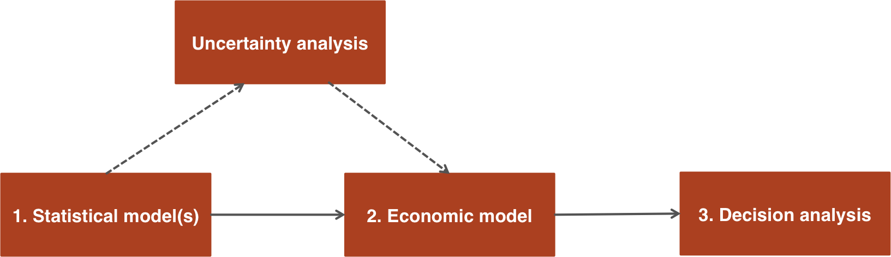

## Overview
`hesim` is an R package that integrates statistical modeling, economic modeling, and decision analysis for the economic evaluation of health technologies. Economic evaluation proceeds in a three-step process as shown in the figure (adapted from [BCEAweb](https://egon.stats.ucl.ac.uk/projects/BCEAweb/)) below .

<br>
```{r, out.width = "600px", echo = FALSE}

```
<br>
<br>

First, a statistical model (or statistical models) are fit to estimate parameters. Second, the parameters are combined to construct an economic model, which, in turn, is used to simulate measures of clinical benefits (e.g., quality-adjusted life-years (QALYs)) and costs. Third, the economic value of a medical technology is evaluated by summarizing clinical benefits and costs. The entire analysis is inherently Bayesian, as uncertainty in the parameters from the statistical models is propagated throughout the economic model and decision analysis with probabilistic sensitivity analysis (PSA). Furthermore, since the statistical and economic models are integrated, patient heterogeneity can be easily introduced with patient level covariates.

`hesim` focuses on **step 2** (economic modeling) but is naturally integrated with step 1 (statistical modeling) and provides support for step 3 (decision analysis). As shown in the figure below, a typical analysis would proceed as follows:

1. The parameters of a statistical model are estimated using an "estimation" dataset, such as extracted data from published studies for a meta-analysis or multi-state survival data from a clinical trial. Parameters are estimated for disease progression, utility, and costs. Each statistical model is constructed by combining the parameter estimates with information on the treatment strategies, patients, and/or health states of interest for the economic model.
2. The disease progression, utility, and cost models are combined into a coherent economic model to simulate outcomes of interest such as disease progression, QALYs, and costs.
3. Relevant outcomes from step 2 are used to perform decision analysis using approaches such as [cost-effectiveness analysis (CEA)](https://en.wikipedia.org/wiki/Cost-effectiveness_analysis) and [multi-criteria decision analysis (MCDA)](https://en.wikipedia.org/wiki/Multiple-criteria_decision_analysis). 

<br>
```{r, out.width = "800px", echo = FALSE}
knitr::include_graphics("econ-eval-process-hesim.png")
```
<br>
<br>

`hesim` supports both cohort-level and individual-level economic models. The cohort-level models simulate disease progression for representative cohorts of patients with similar characteristics while the individual-level models simulate individual patients probabilistically using random number generation. Economic models currently supported include:

* N-state partitioned survival models (PSMs)
* Individual-level continuous time state transition models (CTSTMs)

The package is under active development and new features are being added. We expect to release a stable version of the package in the beginning of January and to add cohort-level CTSTMs and cohort-level discrete time state transition models (DTSTMs). 

## Statistical models
The statistical models in `hesim` are characterized by a distribution over outcomes, $y$, which depend on model parameters, $\alpha_1, \ldots, \alpha_L$, 

$$
\begin{aligned}
P(y| \alpha_1(x_1), \ldots, \alpha_L(x_L)).
\end{aligned}
$$
The $l$th model parameter can depend on a vector of coefficients, $\beta_l$, and an input vector, $x_l$, of covariates through linked transformed linear models $g(\alpha_l(x_l)) =  x_l^T \beta_l$. The outcomes, $y$, can be predicted using the mean of the distribution, $E(y|\cdot)$, or sampled with a random draw from the probability distribution, $P(y|\cdot)$. 

### Parameter estimates
In `hesim`, the estimated coefficients for each parameter are generally stored in matrices (or a single matrix if the model only has one parameter), where the columns of each matrix are covariates and the rows are random samples from a relevant probability distribution (i.e. the posterior distribution in a Bayesian model). Parameters are stored in objects prefixed by `params_` (e.g., `params_surv` for a survival model, `params_lm` for a linear model). A `params_` prefixed object can be created in one of two ways:

1. With a function of the same name such as `params_surv()` or `params_lm()`
2. By using the generic function `create_params()` to create objects from fitted statistical models

This flexibility is provided so that parameters can either be estimated using models fit with `R` or from an external source. Here we illustrate the second method by fitting a 3 state (4 transition) Weibull multi-state model using `flexsurvreg()` from the [flexsurv](https://cran.r-project.org/web/packages/flexsurv/index.html) package. We randomly draw 3 samples of the coefficients for the shape and scale parameters from a multivariate normal distribution that approximates the Bayesian posterior distribution and store them in a `params_surv` object (note that `hesim` accepts Weibull distributions by the name "weibull" or "weibull.quiet").

```{r  warning = FALSE, message = FALSE}
library("hesim")
library("flexsurv")
library("data.table")

n_samples <- 3 
mstate_data <- data.table(hesim::ctstm3_exdata$transitions)
mstate_data[, trans := factor(trans)]
fit_wei <- flexsurv::flexsurvreg(Surv(years, status) ~ factor(strategy_id)*trans +
                                                    shape(trans), 
                                                    data = mstate_data, 
                                                    dist = "weibull")
params_wei <- create_params(fit_wei, n = n_samples)
print(params_wei)
```

### Input data
The input vectors for each parameter, $x_{l,hijk}$, are rows in multidimensional input matrices, $X_l$, where each row denotes a unique observation. The input matrix for parameter $l$ is indexed by health-related indices $h$ and patients $i$ for a treatment strategy $k$. Example health-related indices include a health state, a transition between two health states, or a survival endpoint in a partitioned survival model (PSM). In some cases, the health-related index $h$ can be suppressed and separate models can be fit for each health index. This is, for instance, the case in a PSM where separate models are fit for each survival endpoint. 

The data and variables needed for the statistical models are stored in objects of class "expanded_hesim_data", which are [data tables](https://github.com/Rdatatable/data.table/wiki) or data frames in long format that contain (i) treatment strategy, patient, and/or health-related ID variables indexing each row, and (ii) the covariates for the statistical model. The names of the ID variables are attributes of the data table. 

An "expanded_hesim_data" object can be created directly or by expanding an object of class "hesim_data", which contains relevant data for the economic model. For instance, suppose we would like to create a dataset for modeling transitions between 3 health states for 2 treatment strategies and 2 representative patients. We first use `hesim_data()` to store the data for each treatment strategy, representative patient, and transition.

```{r warning = FALSE, message = FALSE}
strategies <- data.table(strategy_id = c(1, 2))
patients <- data.table(patient_id = seq(1, 2),
                          age = c(45, 50),
                          female = c(0, 1))
tmat <- rbind(c(NA, 1, 2),
              c(3, NA, 4),
              c(NA, NA, NA))
colnames(tmat) <- rownames(tmat) <- c("Healthy", "Sick", "Dead")
transitions <- create_trans_dt(tmat)
transitions[, trans := factor(transition_id)]
hesim_dat <- hesim_data(strategies = strategies,
                        patients = patients,
                        transitions = transitions)
print(hesim_dat)
```

Then we use `expand()` to create a dataset in long format where there is one row for each treatment strategy, patient, and transition.
```{r warning = FALSE, message = FALSE}
transmod_data <- expand(hesim_dat, 
                        by = c("strategies", "patients", "transitions"))
transmod_data[1:16]

# These are the ID variables
attributes(transmod_data)$id_vars
```

### Creating a statistical model
A statistical model is instantiated by combining the parameter estimates and input data. A statistical model can be created from an "expanded_hesim_data" object and either a parameter object (prefixed by `params_`) or a fitted statistical model using functions prefixed by `create_`. For example, we can create a model of health state transitions for an individual-level CTSTM using `create_IndivCtstmTrans()` from the `fit_wei` object above, which is a fitted Weibull multi-state model.

```{r}
transmod <- create_IndivCtstmTrans(fit_wei, transmod_data,
                                   trans_mat = tmat, n = 100)
class(transmod)
```

## Economic model
An economic model for an individual-level CTSTM would be constructed by combining the `transmod` object with statistical models for costs and utility. Examples analyses are currently available for [PSMs](psm.html) and [individual-level CTSTMs](https://innovationvalueinitiative.github.io/modern-software-HTA/example.html). 

## Decision analysis
Once output has been simulated with an economic model, a CEA or MCDA can be performed. `hesim` ([here](icea.html)) provides support for CEA including summarizing a PSA and individualized cost-effectiveness analysis. Output from `hesim` economic models can also be easily analyzed using other R packages such as [bcea](https://sites.google.com/a/statistica.it/gianluca/bcea). 