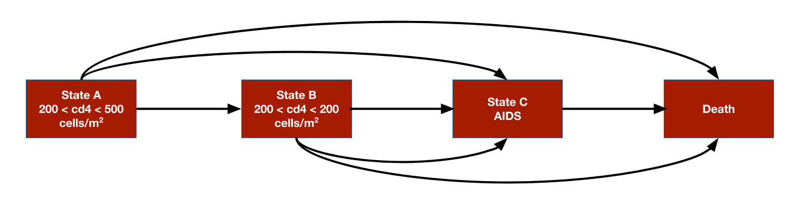

# Overview
The simplest models in `hesim` are cohort discrete time state transitions models (cDTSTMs), which encompass both time-homogeneous and time-inhomogeneous Markov models. Transition probabilities between states are constant over time in time-homogeneous models whereas they can vary over time in time-inhomogeneous models. 

We consider a simple example by replicating the HIV model developed by [Chancellor et al.](https://link.springer.com/article/10.2165/00019053-199712010-00006) and used for didactic purposes in the [*Decision Modeling for Health Economic Evaluation*](https://www.herc.ox.ac.uk/downloads/decision-modelling-for-health-economic-evaluation) textbook. The analysis compares two treatment strategies, zidovudine monotherapy and zidovudine + lamivudine combination therapy. While the model is technically time-inhomogeneous because patients are assumed to only use lamivudine for 2 years before switching back to monotherapy, transition probabilities only change once so it might be referred to as (mostly) homogeneous. 

The model consists 4 health states. Ordered from worst to best to worst, they are: State A (CD4 cells > 200 and < 500 cells/mm3), State B (CD4 < 200 cells/mm3), State C (AIDS), and State D (death). The model assumes that patients can transition to any state that is more severe (i.e., progress) but cannot transition back to a more severe state.

```{r, out.width = "700px", echo = FALSE}

```

# Model setup
We set up the model for two treatment strategies and one representative patient.

```{r, warning = FALSE, message = FALSE}
library("hesim")
library("data.table")
strategies <- data.table(strategy_id = 1:2,
                         strategy_name = c("Monotherapy", "Combination therapy"))
patients <- data.table(patient_id = 1)
hesim_dat <- hesim_data(strategies = strategies,
                        patients = patients)
print(hesim_dat)
```

# Model parameters
## Estimates from the literature
Counts of transitions at yearly intervals between each of the 4 health states were available from a longitudinal dataset from Chelsea and Westminister hospital. 

```{r}
trans_mono <- matrix(c(1251, 350, 116, 17,
                       0, 731, 512, 15,
                       0, 0, 1312, 437,
                       0, 0, 0, 469),
                      ncol = 4, nrow = 4, byrow = TRUE)
colnames(trans_mono) <- rownames(trans_mono) <-  c("A", "B", "C", "D")
print(trans_mono)
```

The transition probabilities from state $r$ to each of the 4 states (State A, State B, State C, and State D) can be modeled using Dirichlet distributions, which are parameterized by a vector of concentration parameters $\alpha = (\alpha_{r1}, \alpha_{r2}, \alpha_{r3}, \alpha_{r4})$. The Dirichlet distribution is particularly useful for modeling uncertainty in the transition probabilities because it is a conjugate prior for the multinomial distribution. The posterior distribution of $\alpha$ consequently follows a Dirichlet distribution which can be thought of as the "effective sample size" for each transition (see Appendix). 

Treatment effects are defined in terms of the relative risk, which is assumed to reduce the probability of all transitions to a more severe health state by an equal amount. We work with the log relative risk since it is approximately normally distributed. The estimated relative risk of disease progression is 0.509 (95% CI 0.365 to 0.710). We can then calculate the mean and standard error on the log scale. 

The cost-effectiveness analysis is based on life-years, meaning that each health state is assigned a utility value of 1. The costs of zidovudine and lamivudine are \$2,278 and \$2,086.50, respectively. Medical costs are split into direct medical and community medical costs.

The parameter estimates are stored in a list.

```{r}
params <- list(
  alpha_mono = trans_mono, 
  lrr_mean = log(.509), 
  lrr_lower <- log(.365),
  lrr_upper = log(.710),
  c_dmed_mean = c(A = 1701, B = 1774, C = 6948),
  c_cmed_mean = c(A = 1055, B = 1278, C = 2059),
  c_zido = 2278,
  c_lam = 2086.50,
  u = 1
)
```

## Random number generation
To perform a probabilistic sensitivity analysis (PSA), it is necessary to draw samples of the parameters from suitable probability distributions. While the probability distributions could have been drawn manually and stored in the `params` object above, it can be more easily done by using random number generation functions with `define_rng()`. 

As noted above, we draw the transition probabilities with monotherapy from a Dirichlet distribution and the relative risk (of a transition to a worse state with combination therapy relative to monotherapy) from a lognormal distribution. Drug costs and utility are assumed to be fixed while medical costs are drawn from gamma distributions.

Sampled parameters values are stored in a list, meaning that samples for each parameter can be stored as either a vector or `data.table` (or matrix or `data.frame`). For instance, we sample medical costs for each (non-death) health state from gamma distributions and they a stored in a `data.table` (one row for each sample and one column for each health state). Likewise, the parameters of each cell in the transition probability matrix are store in a `data.table`, with parameters of the `data.table` ordered rowwise across the columns. On the other hand, samples of the relative risk are stored in a vector. 

```{r}
rng_def <- define_rng({
  lrr_se <- (lrr_upper - lrr_lower)/(2 * qnorm(.975)) # Local object 
                                                      # not returned
  list( # Parameters to return
    p_mono = dirichlet_rng(alpha_mono),
    rr_comb = lognormal_rng(lrr_mean, lrr_se),
    c_zido = c_zido,
    c_lam = c_lam,
    c_dmed = gamma_rng(mean = c_dmed_mean, sd = c_dmed_mean),
    c_cmed = gamma_rng(mean = c_cmed_mean, sd = c_cmed_mean),
    u = u
  )
}, n = 1000)
```

## Transformed parameters
In most statistical models, the underlying parameters are "transformed" into more relevant parameters for prediction. For instance, if a multinomial logistic regression is used parameterize transition probabilities, the coefficients are used to predict the probabilities. While transition, cost, and utility models can be parameterized using supported statistical models with `hesim::params` objects, they can also, in some cases, be parameterized using the transformed parameters themselves with `hesim::tparams` objects. 

We will use the transformed parameter approach here by using `define_tparams()` to define `tparams` objects as a function of the underlying parameters and input data (treatment strategies and patients). We generate the input data using `hesim::expand()`.

```{r}
input_data <- expand(hesim_dat, by = c("strategies", "patients"))
head(input_data)
```

Operations in a `define_tparams()` block are performed using the columns from the input data and a list of parameters . To maximize computational efficiency, all operations are vectorized across the rows in the data and PSA samples. Parameters not included in a transformed parameter function are assumed constant across patients and treatment strategies. A list must be returned with elements for the transition probability matrix, costs, and utilities. 

An important helper function is `tpmatrix()`, which allows users to define transition matrices as a function of other parameters. In this example, transition probabilities are defined in terms of the transition matrix for monotherapy (`p_mono`) and the relative risk (`rr`). The relative risk is simply 1 for monotherapy (since the corresponding transition matrix is just `p_mono`) and equal to `rr_comb` for combination therapy. 

The only costs in the model that vary across treatment strategies (rather than just states) are drug costs. The monotherapy treatment strategy include the cost of zidovudine only whereas the combination therapy includes the costs of both zidovudine and lamivudine.

Parameters may depend on time (since the start of the model) by using the package defined `time` variable. The `time` variable corresponds to the stopping time of time intervals, which are specified using the `times` argument in `define_tparams()`. Since patients are only assumed to use lamivudine for two years, `rr_comb` and the costs of lamivudine are not applied beyond year 2.

```{r}
tparams_def <- define_tparams({
  ## The treatment effect (relative risk) is transformed so that it varies by 
  ## strategies and only applies for the first 2 years (Monotherapy is 
  ## the reference strategy). 
  rr <- ifelse(strategy_name == "Monotherapy" | time > 2, 1, rr_comb)
  
  list(
    tpmatrix = tpmatrix(
      C, p_mono$A_B * rr, p_mono$A_C * rr, p_mono$A_D * rr,
      0, C,               p_mono$B_C * rr, p_mono$B_D * rr,
      0, 0,               C,               p_mono$C_D * rr,
      0, 0,               0,               1
    ),
    utility = u,
    costs = list(
        drug = ifelse(strategy_name == "Monotherapy" | time > 2,
                      c_zido, c_zido + c_lam),
        community_medical = c_cmed,
        direct_medical = c_dmed
    )
  )
}, times = c(2, Inf))
```

# Simulation
## Constructing the economic model
The economic model is defined by using `define_model()` to combine the underlying parameters with the expressions for random number generation and parameter transformation.

```{r}
mod_def <- define_model(tparams_def = tparams_def, 
                        rng_def = rng_def, 
                        params = params)
```


A economic model (of class `CohortDtstm`) can be created from the defined model and input data using the generic function `create_CohortDtstm()`. The economic model is an `R6` object consisting of a transition model (`trans_model`) for simulating transition probabilities with `sim_stateprobs()`, a utility model for simulating quality-adjusted life-years with `sim_qalys()`, and a set of cost models (for each cost category) for simulating costs with `sim_costs()`. 

```{r econmod}
econmod <- create_CohortDtstm(mod_def, input_data)
```

## Simulating outcomes
### Health state probabilities
At the start of the model, all patients are assumed to be in State A (the default setting of the transition model of class `CohortDtstmTrans`). State occupancy probabilities are generated by simulating the discrete time Markov chain; as expected, patients survive longer with combination therapy. 

```{r simStateprobs, fig.width = 7, fig.height = 6}
econmod$sim_stateprobs(n_cycles = 20)

# Plot
library("ggplot2")
theme_set(theme_bw())
stateprob_summary <- econmod$stateprobs_[, .(prob_mean = mean(prob),
                                              prob_lower = quantile(prob, .025),
                                              prob_upper = quantile(prob, .975)),
                                          by = c("strategy_id", "state_id", "t")]
stateprob_summary[, strategy_name := factor(strategy_id,
                                          labels = strategies$strategy_name)]
ggplot(stateprob_summary, aes(x = t, y = prob_mean)) +
  geom_line(aes(col = strategy_name)) +
  geom_ribbon(aes(x = t, ymin = prob_lower, ymax = prob_upper,
                  fill = strategy_name), alpha = .3) +
  facet_wrap(~factor(state_id, labels = LETTERS[1:4])) +
  xlab("Year") + ylab("Probability") +
  scale_fill_discrete("Strategy") + scale_color_discrete("Strategy")
```

### Costs and QALYs
Costs and quality-adjusted life-years (QALYs) are computed by integrating the previously simulated state probabilities. To maintain consistency with Chancellor et al., we approximate the integral with a right Riemann sum, which is simply a sum of costs and QALYs measured at the right endpoint of each interval (e.g., costs during model cycle 1 are measured at time 1 (rather than at say, time 0)).

```{r simStateVals}
econmod$sim_qalys(dr = 0, integrate_method = "riemann_right")
econmod$sim_costs(dr = 0.06, integrate_method = "riemann_right")
```

# Decision analysis
A decision analysis is performed by comparing combination therapy to monotherapy. 

```{r icea}
ce_sim <- econmod$summarize()
wtp <- seq(0, 25000, 500)
icea_pw_out <- icea_pw(ce_sim, comparator = 1, dr_qalys = 0, dr_costs = .06,
                       k = wtp)
```

The incremental cost-effectiveness ratio (ICER) estimated using means from the PSA is $`r icer_tbl(icea_pw_out)["ICER", 2]`, which is very close to the estimate from the deterministic analysis from Chancellor et al.  

```{r icer}
icer_tbl(icea_pw_out)
```

A cost-effectiveness acceptability curve shows that the probability that combination therapy is more cost-effective than monotherapy increases quickly with the willingness to pay (WTP) for a QALY. At $10,000, the probability is `r icea_pw_out$ceac[k == 10000, prob]` and approaches 1 at slightly higher WTP values.   

```{r ceac, fig.width = 6, fig.height = 4}
ggplot(icea_pw_out$ceac, 
       aes(x = k, y = prob, 
           col = factor(strategy_id, labels = strategies$strategy_name[-1]))) +
  geom_line()  + xlab("Willingness to pay") +
  ylab("Probability cost-effective") +
  scale_x_continuous(breaks = seq(0, max(wtp), 5000), label = scales::dollar) +
  theme(legend.position = "bottom") + scale_colour_discrete(name = "Strategy")
```

# Appendix: Dirichlet distribution
The multinomial distribution is a discrete probability distribution for the number of successes for each of k mutually exclusive categories in n trials. The probabilities of the categories are given by $\pi_1,\ldots, \pi_k$ with $\sum_{j=1}^k \pi_j=1$ and each $\pi_j$ defined on $[0,1]$. The Dirichlet distribution is parameterized by the concentration parameters $\alpha_1,\ldots, \alpha_k$ with $\alpha_j > 0$. Letting $x_1,\ldots, x_k$ denote the number of successes in each category, the prior distribution and likelihood are,

$$
\begin{aligned}
p(\pi_1,\ldots,\pi_k |\alpha_1,\ldots, \alpha_k) = \text{Dirichlet}(\alpha_1,\ldots,\alpha_k) \\
p(x_1,\ldots,x_k | \pi_1,\ldots,\pi_k) = \text{Multin}(n, \pi_1,\ldots,\pi_k).
\end{aligned}
$$

The posterior distribution for $\pi_1,\ldots,\pi_k$ is then given by, 

$$
p\left(\pi_1,\ldots,\pi_k| x_1,\ldots,x_k, \alpha_1,\ldots,\alpha_k \right) = \text{Dirichlet}\left(\alpha_1 + x_1, \ldots, \alpha_k + x_k\right).
$$