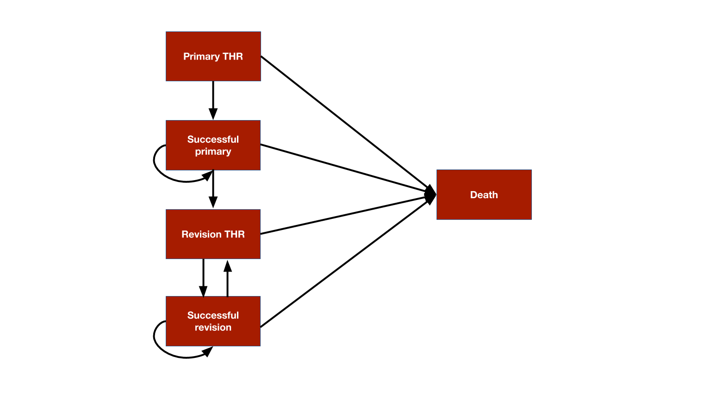

# Overview
We will illustrate a time inhomogeneous Markov cohort model by replicating the total hip replacement (THR) example from the [*Decision Modeling for Health Economic Evaluation*](https://www.herc.ox.ac.uk/downloads/decision-modelling-for-health-economic-evaluation) textbook. The analysis compares two treatment strategies, a "standard" prosthesis and a "new" prosthesis. A probabilistic sensitivity analysis (PSA) will be used to quantify parameter uncertainty.  

The model consists 5 health states: (i) primary THR, (ii) successful primary, (iii) revision THR, (iv) successful revision, and (v) death. 

```{r, out.width = "700px", echo = FALSE}

```

The model is time-inhomogeneous because (i) the prosthesis survival time is modeled using a Weibull survival model so that the probability of failure is time-varying and (ii) background mortality rates increase as patients age. 

# Define the model
## Data
We set up the model for two treatment strategies and 10 subgroups defined by age and sex.

```{r, warning = FALSE, message = FALSE}
library("hesim")
library("data.table")

# Treatment strategies
strategies <- data.table(strategy_id = 1:2,
                         strategy_name = c("Standard prosthesis", "New prosthesis"))

# Patients
ages <- seq(55, 75, 5)
age_weights <- c(.05, .1, .4, .25, .20)
gender_weights <- c(.65, .35)
weights <- rep(age_weights, times = 2) * 
           rep(gender_weights, each = length(ages))
patients <- data.table(patient_id = 1:10,
                       grp_id = 1:10,
                       gender = rep(c("Female", "Male"), each = length(ages)),
                       age = rep(ages, times = 2),
                       patient_wt = weights)
hesim_dat <- hesim_data(strategies = strategies,
                        patients = patients)
print(hesim_dat)
```

The model will be simulated for each treatment strategy and patient combination. Data containing treatment strategy and patient characteristics can be generated using `expand()`. 

```{r}
data <- expand(hesim_dat, by = c("strategies", "patients"))
head(data)
```

## Parameters
### Transition probabilities
Transition probabilities from state $i$ (rows) to state $j$ (columns) are determined using the parameters shown in the table below:

* **C**: The complement of other probabilities in a given row
* **omrPTHR**: Operative mortality rate following primary THR
* **rr**: Revision rate for prosthesis
* **mr**: Age and gender-specific mortality rates
* **omrRTHR**: Operative mortality rate following revision THR
* **rrr**: Re-revision rate 

```{r, echo = FALSE}
library("kableExtra")
tpmat <- matrix(
  c(0, "C", 0, 0, "omrPTHR",
    0, "C", "rr", 0, "mr",
    0, 0, 0, "C", "omrRTHR + mr",
    0, 0, "rrr", "C", "mr",
    0, 0, 0, 0, 1),
  nrow = 5, ncol = 5, byrow = TRUE
)
colnames(tpmat) <- rownames(tpmat) <- c(
  "Primary THR", 
  "Successful primary",
  "Revision THR",
  "Successful revision",
  "Death"
)
knitr::kable(tpmat) %>%
  kable_styling()
```

Three parameters of the transition probability matrix are assumed to be constant in the model: (i) the operative mortality rate following primary THR, *omrPTHR*, (ii)  the operative mortality rate following revision THR, *omrRTHR*, and the re-revision rate, *rrr*. In a sample of 100 patients receiving primary THR 2 died implying that *omrPTHR* can be characterized by a beta distribution with $\alpha = 2$ and $\beta = 98$. Similarly, in a sample of 100 patients experiencing a revision procedure, four patients had another procedure within one year suggesting that *rrr* can be characterized by a beta distribution with $\alpha = 4$ and $\beta = 96$. Finally. there was information available for *omrRTHR*, so it assumed to follow the same beta distribution ($\alpha = 2$ and $\beta = 98$) as *omrPTHR*.

The remaining parameters, *rr* and *mr*, are time-varying. The yearly mortality rates, *mr*, are stratified by age and sex.

```{r, echo = FALSE}
mort_tbl <- rbind(
  c(35, 45, .00151, .00099),
  c(45, 55, .00393, .0026),
  c(55, 65, .0109, .0067),
  c(65, 75, .0316, .0193),
  c(75, 85, .0801, .0535),
  c(85, Inf, .1879, .1548)
)
colnames(mort_tbl) <- c("age_lower", "age_upper", "male", "female")
mort_tbl <- data.frame(mort_tbl)
```

```{r}
print(mort_tbl)
```

Revision rates, *rr*, were modeled using a proportional hazards Weibull model. The scale parameter was modeled as a function of age and indicators for male sex and and whether a new prosthesis was used. That is, given a scale parameter $\lambda$ and a shape parameter $\gamma$, the survival function is,

$$
S(t) = \exp(-\lambda t^\gamma) \\
\lambda = \exp(\beta_0 + \beta_1 \cdot age + \beta_2 \cdot male + \beta_3 \cdot new) \\
$$

Note that this Weibull distribution corresponds to the distribution implemented in `flexsurv::pweibullPH()` with $a = \gamma$ and $m = \lambda$. It can be shown (see Appendix below) that the transition probabilities (with a one-year model cycle) are given by,

$$
1 - \exp \left\{\lambda\left[(t-1)^\gamma - t^\gamma \right] \right\}
$$
The coefficients from the regression model and the variance-covariance matrix used for the PSA are stored in `rr_coef` and `rr_vcov`, respectively.

```{r, echo = FALSE}
# Coefficients
rr_coef <- c(0.3740968, -5.490935, -0.0367022, 0.768536, -1.344474)
names(rr_coef) <- c("lngamma", "cons", "age", "male", "np1")

# Variance-covariance matrix
rr_vcov <- matrix(
  c(0.0474501^2, -0.005691, 0.000000028, 0.0000051, 0.000259,
    -0.005691, 0.207892^2, -0.000783, -0.007247, -0.000642,
    0.000000028, -0.000783, 0.0052112^2, 0.000033, -0.000111,
    0.0000051, -0.007247, 0.000033, 0.109066^2, 0.000184,
    0.000259, -0.000642, -0.000111, 0.000184, 0.3825815^2),
  ncol = 5, nrow = 5, byrow = TRUE
)
rownames(rr_vcov) <- colnames(rr_vcov) <- names(rr_coef)
```

```{r}
print(rr_coef)
print(rr_vcov)
```

### Utility
The mean (standard error) of utility was estimated to be 0.85 (0.03), 0.30 (0.03), and 0.75 (0.04) in the successful primary, revision, and successful revision health states, respectively. 

### Costs
The largest costs are the cost of the prostheses themselves. The standard prosthesis costs $£394$ while the new prosthesis costs $£579$. Both are assumed to be known with certainty. 

The model assumes that there are no ongoing medical costs. The only remaining cost is therefore the cost of the revision procedure, which was estimated to have a mean of $£5,294$ and standard error of $£1,487$.

### Combining all parameters
All underlying parameter estimates are stored in a list.

```{r}
params <- list(
  # Transition probabilities
  ## Operative mortality following primary THR
  omrPTHR_shape1 = 2, 
  omrPTHR_shape2 = 98,
  
  ## Revision rate for prosthesis
  rr_coef = rr_coef,
  rr_vcov = rr_vcov,
    
  ## Mortality_rates
  mr = mort_tbl,
  
  ## Operative mortality following revision THR
  omrRTHR_shape1 = 2,
  omrRTHR_shape2 = 98,
  
  ## re-revision rate
  rrr_shape1 = 4,
  rrr_shape2 = 96,
  
  # Utility
  u_mean = c(PrimaryTHR = 0, SuccessP = .85, Revision = .30, SuccessR = .75),
  u_se = c(PrimaryTHR = 0, SuccessP = .03, Revision = .03, SuccessR = .04),
  
  # Costs
  c_med_mean = c(PrimaryTHR = 0, SuccessP = 0, Revision = 5294, SuccessR = 0),
  c_med_se = c(PrimaryTHR = 0, SuccessP = 0, Revision = 1487, SuccessR = 0),
  c_Standard = 394,
  c_NP1 = 579
)
```

## Random number generation
As noted above, *omrPTHR*, *omrRTHR*, and *rrr* are drawn from beta distributions whith $\alpha$ and $\beta$ (i.e. `shape1` and `shape2`) specified. Similarly, utility is drawn from a beta distribution, but `shape1` and `shape2` are derived from the mean and standard error using the method of moments. The mortality rate and the cost of the prostheses are assumed to be known with certainty. The medical costs associated with health states are drawn from a gamma distribution, for which, like utility, the underlying parameters are derived from the mean and standard error using the method of moments. Finally, the parameters of the Weibull survival model are drawn from a multivariate normal distribution using the point estimates and the variance-covariance matrix. 500 samples will be drawn for the PSA. 

```{r}
rng_def <- define_rng({
  list( 
    omrPTHR = beta_rng(shape1 = omrPTHR_shape1, shape2 = omrPTHR_shape2),
    rr_coef = multi_normal_rng(mu = rr_coef, Sigma = rr_vcov),
    mr_male = fixed(mr$male, names = mr$age_lower),
    mr_female = fixed(mr$female, names = mr$age_lower),
    omrRTHR = beta_rng(shape1 = omrRTHR_shape1, shape2 = omrRTHR_shape2),
    rrr = beta_rng(shape1 = rrr_shape1, shape2 = rrr_shape2),
    u = beta_rng(mean = u_mean, sd = u_se),
    c_med = gamma_rng(mean = c_med_mean, sd = c_med_se),
    c_Standard = c_Standard,
    c_NP1 = c_NP1
  )
}, n = 500)
```

## Transformed parameters
The sampled parameter values are "transformed" as a function of the input data. When evaluating the `define_tparams()` expression, operations are vectorized and performed for each combination of the sampled parameters, input data, and time periods. The model will be simulated for 60 model cycles (i.e., 60 years) so we will create 60 time intervals of length 1.

Separate transformation functions are used for the transition model and the cost/utility models. This is done for computational efficiency since only the transition model depends on cycle time. In the transition model, the revision rate (*rr*) depends on the scale and the shape parameters, which, in turn, depend on the sampled values of the parameters from the Weibull model. The mortality rate depends on gender and a patient's age during each model cycle. 

```{r}
transitions_def <- define_tparams({
  # Regression for revision risk
  male <- ifelse(gender == "Female", 0, 1)
  np1 <- ifelse(strategy_name == "Standard prosthesis", 0, 1)
  scale <- exp(rr_coef$cons + rr_coef$age * age + rr_coef$male * male + 
                 rr_coef$np1 * np1)
  shape <- exp(rr_coef$lngamma)
  rr <- 1 - exp(scale * ((time - 1)^shape - time^shape))
    
  # Mortality rate
  age_new <- age + time
  mr <- mr_female[["35"]] * (gender == "Female" & age_new >= 35 & age_new < 45) +
        mr_female[["45"]] * (gender == "Female" & age_new >= 45 & age_new < 55) +
        mr_female[["55"]] * (gender == "Female" & age_new >= 55 & age_new < 65) +
        mr_female[["65"]] * (gender == "Female" & age_new >= 65 & age_new < 75) +
        mr_female[["75"]] * (gender == "Female" & age_new >= 75 & age_new < 85) +
        mr_female[["85"]] * (gender == "Female" & age_new >= 85) +
        
        mr_male[["35"]] * (gender == "Male" & age_new >= 35 & age_new < 45) +
        mr_male[["45"]] * (gender == "Male" & age_new >= 45 & age_new < 55) +
        mr_male[["55"]] * (gender == "Male" & age_new >= 55 & age_new < 65) +
        mr_male[["65"]] * (gender == "Male" & age_new >= 65 & age_new < 75) +
        mr_male[["75"]] * (gender == "Male" & age_new >= 75 & age_new < 85) +
        mr_male[["85"]] * (gender == "Male" & age_new >= 85)
  
  list(
    tpmatrix = tpmatrix(
      0, C, 0, 0, omrPTHR,
      0, C, rr, 0, mr,
      0, 0, 0, C, omrRTHR + mr,
      0, 0, rrr, C, mr,
      0, 0, 0, 0, 1)
  )
}, times = 1:60)

statevals_def <- define_tparams({
  c_prosthesis <- ifelse(strategy_name == "Standard prosthesis",
                         c_Standard,
                         c_NP1)
  list(
    utility = u,
    costs = list(
            prosthesis = c_prosthesis,
      medical = c_med
    )
  )
})
```

## The model
The model is defined by specifying parameter estimates, a random number generation expression for the PSA, and the transformed parameter expressions.

```{r}
mod_def <- define_model(tparams_def = list(transitions_def, 
                                           statevals_def),
                        rng_def = rng_def, 
                        params = params)
```

# Simulation
The economic model is created from the input data and the defined model. Arguments for instantiating the cost models (a list of objects of class `StateVals`) can be specified with a named list containing the values of arguments to pass to `StateVals$new()`. In this case, we note that the model for the cost of the prostheses is based on one-time costs accrued at the start of the model (with no discounting); conversely, medical costs accrue by weighting state values by time spent in the health states (in the current model simply the cost of revision over 1 year).    

```{r econmod}
cost_args <- list(
  prosthesis = list(method = "starting"),
  medical = list(method = "wlos")
)
econmod <- create_CohortDtstm(mod_def, data,
                              cost_args = cost_args)
```

## Health state probabilities
Health state probabilities are simulated for 60 model cycles. 
```{r simStateprobs}
econmod$sim_stateprobs(n_cycles = 60)
```

The expected number of patients per 1,000 in each health state is plotted below. The counts in the plot are for `patient_id = 2`, a 60 year old female as in the original textbook example. Since a PSA was performed both mean values and 95 percent credible intervals can be displayed. Patients are more likely to have a revision with a standard prosthesis than with the new prosthesis.

```{r simStateprobsPlot, echo = FALSE}
library("ggplot2")
theme_set(theme_bw())
stateprob_summary <- econmod$stateprobs_[patient_id == 2, 
                                          .(count_mean = mean(prob) * 1000,
                                            count_lower = 1000 * quantile(prob, .025),
                                            count_upper = 1000 * quantile(prob, .975)),
                                          by = c("strategy_id", "patient_id", "state_id", "t")]
stateprob_summary[, strategy_name := factor(strategy_id,
                                            labels = strategies$strategy_name)]
ggplot(stateprob_summary, aes(x = t, y = count_mean)) +
  geom_line(aes(col = strategy_name)) +
  geom_ribbon(aes(x = t, ymin = count_lower, ymax = count_upper,
                  fill = strategy_name), alpha = .3) +
  facet_wrap(~factor(state_id, labels = colnames(tpmat)),
             scale = "free_y") +
  xlab("Year") + ylab("Count") +
  scale_fill_discrete("Strategy") + scale_color_discrete("Strategy")
```

## Costs and QALYs
To again be consistent with the textbook example, QALYs and costs are simulated with discount rates of .015 and 0.06, respectively. QALYs and costs (when `method = "wlos"`) are computed with a right Riemann sum, meaning that they are measured at the right endpoint of each model cycle. 

```{r simStateVals}
econmod$sim_qalys(dr = .015, integrate_method = "riemann_right")
econmod$sim_costs(dr = .06, integrate_method = "riemann_right")
```

# Decision analysis
## Subgroup analysis
Subgroup analyses can be performed with `$sim_summarize()` using the `by_grp = TRUE` option. Cost-effectiveness analyses are then performed for each subgroup (`grp_id`) from input data. We will begin by reporting results for the 60-year old female, which are consistent with those from the textbook.

```{r icea}
ce_sim <- econmod$summarize(by_grp = TRUE)
wtp <- seq(0, 25000, 500)
icea_pw_out <- icea_pw(ce_sim, comparator = 1, dr_qalys = 0.015, dr_costs = .06,
                       k = wtp)

ce_sim$qalys[grp_id == 2, 
              .(mean = mean(qalys)),
                by = c("strategy_id", "grp_id")]
ce_sim$costs[grp_id == 2 & category == "total", 
            .(mean = mean(costs)),
              by = c("strategy_id", "grp_id")]
```

We can then compute incremental cost-effectiveness ratios for each subgroup. There is considerable variation which is not unexpected since the the revision rate for prostheses (*rr*) depends on covariates. 

```{r icerSubgroup}
icer_tbl(icea_pw_out, output = "data.table")
```

## Overall
Estimates aggregated across all patients can also be computed with `$sim_summarize()` by using `by_grp = FALSE`. In this case, overall costs and QALYs are a weighted average (using the column `patient_wt`) of costs and QALYs for each patient in the input data.

```{r icerOverall}
ce_sim <- econmod$summarize(by_grp = FALSE)
icea_pw_out <- icea_pw(ce_sim, comparator = 1, dr_qalys = .015, dr_costs = .06,
                       k = wtp)
icer_tbl(icea_pw_out)
```

# Appendix: Transition probabilities from a Weibull survival model
In general, the transition probability of an event given a model cycle is the probability a patient has an event during the cycle conditional on not having an event up until that cycle. That is, given a survivor function, $S(t)$ and a cylce of length $u$, the transition probability, $tp(t_u)$ of an event is,

$$
\begin{align}
tp(t_u) &= \frac{1 - S(t)}{S(t-u)} \\
&= \frac{1 - exp\{-H(t)\}}{exp\{-H(t-u)\}} \\
&= 1 - exp\{H(t-u) - H(t)\},
\end{align}
$$

where $H(t)$ is the cumulative hazard function.

The proportional hazard Weibull distribution with scale parameter $\lambda$ and shape parameter, $\gamma$  has the cumulative hazard function,

$$
H(t) = \lambda t^\gamma
$$
The transition probability of an event for the Weibull model is thus,

$$
\begin{align}
tp(t_u) &= 1 - exp\{\lambda (t-u)^\gamma -\lambda t^\gamma\} \\
&= 1 - exp\{\lambda[(t-u)^\gamma  - t^\gamma]\}
\end{align}
$$