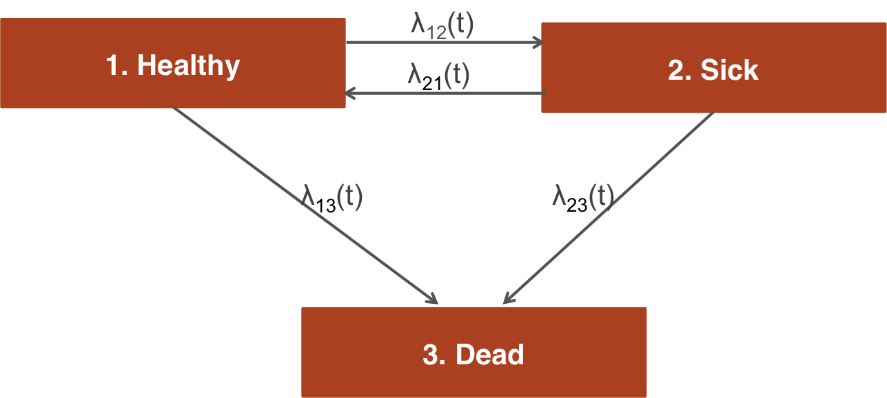

# Overview
The [individual patient simulation (IPS) vignette](ips.html) shows how to simulate a continuous times state transition model (CTSTM) and perform a cost-effectiveness analysis (CEA). The model was parameterized using a variety of disparate data sources and parameter estimates. However, in an ideal scenario, a CTSTM can be fully parameterized by estimating a single statistical model. In this example, we demonstrate by fitting a multi-state model---a generalization of a survival model with more than two states---using patient-level data.

# An example 3-state model
The reversible illness-death model is a commonly used state transition model (see figure below) with 3 health states and 4 transitions. In this example, we will use 3 generic health states: (1) Healthy, (2) Sick, and (3) Dead. The following 4 transitions are possible.

1. Healthy to Sick
2. Sick to Healthy
3. Healthy to Dead
4. Sick to Dead

<br>
```{r, out.width = "500px", echo = FALSE}

```
<br>
<br>

In general, the transitions of a multi-state model can be characterized with an H x H transition matrix where $H$ is the number of health states, which is a square-matrix where the (r,s) element is a positive integer if a transition from r to s is possible and NA otherwise. A 4 x 4 transition matrix is appropriate for the reversible illness death model.

```{r}
tmat <- rbind(c(NA, 1, 2),
              c(3, NA, 4),
              c(NA, NA, NA))
colnames(tmat) <- rownames(tmat) <- c("Healthy", "Sick", "Dead")
print(tmat)
```

In a cost-effectiveness analysis, the treatments strategies of interest and characteristics of the target population must be specified in addition to the selected model structure. We will consider a simple case with two treatment strategies and a heterogeneous population of 1000 patients who differ by age and gender. The model contains 3 health states (2 of which are non-death states). 

```{r, warning = FALSE, message = FALSE}
library("hesim")
library("data.table")
strategies <- data.table(strategy_id = c(1, 2))
n_patients <- 1000
patients <- data.table(patient_id = 1:n_patients,
                       age = rnorm(n_patients, mean = 45, sd = 7),
                       female = rbinom(n_patients, size = 1, prob = .51))
states <- data.table(state_id = c(1, 2),
                     state_name = c("Healthy", "Sick")) # Non-death health states
hesim_dat <- hesim_data(strategies = strategies,
                        patients = patients, 
                        states = states)
```

# Parameter estimation
## Multi-state model
CTSTMs can be parameterized by fitting statistical models in `R` or by storing the parameters from a model fit outside `R` as described in the [introduction](intro.html#disease-progression) to `hesim`. Either a single joint model can be estimated encompassing all transitions or separate models can be estimated for each possible transition. In the [introduction](intro.html#disease-progression) we considered a joint model; here, we will fit separate models. A number of parametric and flexibly parametric approaches are available (as described more detail in the `params_surv()` documentation), but we will illustrate with a generalized gamma model.

We will begin by fitting a "clock reset" model using `flexsurvreg()`. 

```{r, warning = FALSE, message = FALSE}
library("flexsurv")
n_trans <- max(tmat, na.rm = TRUE) # Number of transitions
wei_fits_cr <- vector(length = n_trans, mode = "list") 
for (i in 1:length(wei_fits_cr)){
  wei_fits_cr[[i]] <- flexsurv::flexsurvreg(Surv(years, status) ~ factor(strategy_id), 
                                            data = mstate3_exdata$transitions, 
                                            subset = (trans == i) , 
                                            dist = "weibull") 
}
wei_fits_cr <- flexsurvreg_list(wei_fits_cr)
```

"Clock forward" models are fit in a similar fashion by specifying both the starting (`Tstop`) and stopping (`Tstop`) times associated with each transition. 

```{r}
wei_fits_cf <- vector(length = n_trans, mode = "list") 
for (i in 1:length(wei_fits_cf)){
  wei_fits_cf[[i]] <- flexsurv::flexsurvreg(Surv(Tstart, Tstop, status) ~ factor(strategy_id), 
                                            data = mstate3_exdata$transitions, 
                                            subset = (trans == i) , 
                                            dist = "weibull") 
}
wei_fits_cf <- flexsurvreg_list(wei_fits_cf)
```

## Utility and costs
The most straightforward way to assign utility and cost values to health states is with a `stateval_tbl()`. For example, we can specify the mean and standard error of utilities by health state (implying that utility values do not vary by treatment strategy or patient) and that we will use a beta distribution to randomly sample utility values for the probabilistic sensitivity analysis (PSA). 

```{r}
utility_tbl <- stateval_tbl(data.table(state_id = states$state_id,
                                       mean = mstate3_exdata$utility$mean,
                                       se = mstate3_exdata$utility$se),
                            dist = "beta",
                            hesim_data = hesim_dat)
head(utility_tbl)

```

Drug and medical costs can be specified in a similar fashion. Drug costs are assumed to be known with certainty and vary by treatment strategy whereas medical costs are assumed to vary by health state and to follow a gamma distribution. 

```{r}
drugcost_tbl <- stateval_tbl(data.table(strategy_id = strategies$strategy_id,
                                       est = mstate3_exdata$costs$drugs$costs),
                            dist = "fixed",
                            hesim_data = hesim_dat) 
medcost_tbl <- stateval_tbl(data.table(state_id = states$state_id,
                                       mean = mstate3_exdata$costs$medical$mean,
                                       se = mstate3_exdata$costs$medical$se),
                            dist = "gamma",
                            hesim_data = hesim_dat)  
```


# Simulation

## Constructing the economic model
As in any `hesim` model, the economic model consists of a model for disease progression and models for assigning utility and cost values to health states. In this example, we will use 1000 samples of the parameters for the probabilistic sensitivity analysis (PSA).

```{r}
n_samples <- 1000
```

### Disease model
We begin by constructing the model for health state transitions, which is a function of input data (i.e., covariates) and a fitted multi-state model (or a parameter object). When separate multi-state models are fit by transition, the input data consists of one observation for each treatment strategy and patient combination (joint models consist of one observation for each treatment strategy, patient, and transition combination). It can be created easily by using the `expand()` function to expand the `hesim_data()` object created above.

```{r}
transmod_data <- expand(hesim_dat, 
                        by = c("strategies", "patients"))
head(transmod_data)
```

"Clock reset" and "clock forward" transition models are created by combining the fitted models and input data with the transition matrix, desired number of PSA samples, the timescale of the model, and the starting age of each patient in the simulation (by default, patients are assumed to live no longer than age 100 in the individual-level simulation).

```{r}
transmod_cr <- create_IndivCtstmTrans(wei_fits_cr, transmod_data,
                                      trans_mat = tmat, n = n_samples,
                                      clock = "reset",
                                      start_age = patients$age)
transmod_cf <- create_IndivCtstmTrans(wei_fits_cf, transmod_data,
                                      trans_mat = tmat, n = n_samples,
                                      clock = "forward",
                                      start_age = patients$age)
```

It is a good idea to evaluate the assumptions underlying multi-state models. `hesim` can help facilitate these analyses since hazards (`$hazard()`), cumulative hazards (`$cumhazard()`), and state probabilities (`$stateprobs()`) can be easily computed. As an illustration, we will predict hazards using the maximum likelihood estimates of the Weibull model for a single patient (`patient_id = 1`). To do so, we create new transition models based on a subset of the dataset `transmod_data` used above.

```{r}
# Predict hazard
transmod_data_pat1 <- transmod_data[patient_id == 1]
predict_haz <- function(fits, clock){
 transmod_cr_pat1 <- create_IndivCtstmTrans(fits, transmod_data_pat1,
                                            trans_mat = tmat, 
                                            clock = clock,
                                            point_estimate = TRUE)
  haz <- transmod_cr_pat1$hazard(t = seq(0, 20, 1))
  title_clock <- paste(toupper(substr(clock, 1, 1)), 
                       substr(clock, 2, nchar(clock)), sep="")
  haz[, clock := title_clock]
  return(haz[, ])
}
```

We then plot the predicted hazard by treatment strategy and timescale.

```{r predicted_hazards_plot, fig.width = 7, fig.height = 4}
# Plot hazards
library("ggplot2")
haz <- rbind(predict_haz(wei_fits_cr, "reset"),
             predict_haz(wei_fits_cf, "forward"))
haz[, trans_name := factor(trans,
                           levels = 1:4,
                           labels = c("Healthy-> Sick", 
                                      "Healthy -> Dead",
                                      "Sick -> Healthy",
                                      "Sick -> Dead"))]
ggplot(haz[t > 0], 
       aes(x = t, y = hazard, col = clock, linetype = factor(strategy_id))) + 
  geom_line() + 
  facet_wrap(~trans_name) +
  xlab("Years") + ylab("Hazard") +
  scale_linetype_discrete(name = "Strategy") +
  scale_color_discrete(name = "Clock") + theme_bw()
```

While the hazards from the healthy state are similar between the "clock forward" and "clock reset" approaches, they differ significantly in the sick state. Treatment effects (i.e., the hazard ratios between treatment strategies 1 and 2) are also largest in the sick state. 

Additional analyses should be conducted as well. For instance, the hazards for treatment strategy 1 (the reference treatment strategy) could be assessed by comparing the Weibull model's predictions with predictions from non-parametric (i.e., the Kaplan-Meier estimator) or semi-parametric (i.e., Cox) models. This can be performed using `mstate`, which can predict cumulative hazards and state probabilities in non-parametric and semi-parametric models. Furthermore, the Weibull model's proportional hazards assumption should be tested using standard techniques such as plots of log time vs. the log cumulative hazard, inclusion of time-dependent covariates, and tests of the Schoenfeld residuals. 

### Utility and cost models
Cost and utility models can be easily created from the `stateval_tbl()` output above. Note that these models are based on predicted means (see `tparams_mean()`) and do depend on covariates.

```{r}
# Utility
utilitymod <- create_StateVals(utility_tbl, n = n_samples)

# Costs
drugcostmod <- create_StateVals(drugcost_tbl, n = n_samples)
medcostmod <- create_StateVals(medcost_tbl, n = n_samples)
costmods <- list(Drug = drugcostmod,
                 Medical = medcostmod)
```

### Combining the disease progression, cost, and utility models
Now that the necessary transition, utility, and cost models have been created, we combine them to create separate economic models based on the "clock reset" and "clock forward" transition models, respectively. 

```{r}
econmod_cr <- IndivCtstm$new(trans_model = transmod_cr,
                             utility_model = utilitymod,
                             cost_models = costmods)
econmod_cf <- IndivCtstm$new(trans_model = transmod_cf,
                             utility_model = utilitymod,
                             cost_models = costmods)
```

## Simulating outcomes
### Disease progression
Disease progression can be simulated using the `$sim_disease()` method. In the individual-level simulation, unique trajectories through the multi-state model are simulated for each patient, treatment strategy, and PSA sample. Patients transition `from` an old health state that was entered at time `time_start` `to` a new health state at time `time_stop`.

```{r, cache = FALSE}
# "Clock reset"
econmod_cr$sim_disease()
head(econmod_cr$disprog_)

# "Clock forward"
econmod_cf$sim_disease()
```

State occupancy probabilities at different time points are computed using `$sim_stateprobs()`. First, we simulate state probabilities for the "clock reset" model.

```{r}
econmod_cr$sim_stateprobs(t = seq(0, 20 , 1/12)) 
```

We can then compare state probabilities between the competing treatment strategies. 

```{r stprobs_by_strategy_plot, fig.width = 7, fig.height = 4}
# Short funtion add create state name variable to data.tabale
add_state_name <- function(x){
  x[, state_name := factor(state_id,
                           levels = 1:nrow(tmat),
                           labels = colnames(tmat))] 
}

# Short function to create state probability "dataset" for plotting
summarize_stprobs <- function(stateprobs){
  x <- stateprobs[, .(prob_mean = mean(prob)),
                  by = c("strategy_id", "state_id", "t")]
  add_state_name(x)
}

# Plot of state probabilities
stprobs_cr <- summarize_stprobs(econmod_cr$stateprobs_)
ggplot(stprobs_cr, aes(x = t, y = prob_mean, col = factor(strategy_id))) +
  geom_line() + facet_wrap(~state_name) + 
  xlab("Years") + ylab("Probability in health state") +
  scale_color_discrete(name = "Strategy") +
  theme(legend.position = "bottom") +
  theme_bw()
```

Next, we compare the state probabilities from the "clock reset" and "clock forward" models. 

```{r stprobs_by_timescale_plot, fig.width = 7, fig.height = 4}
econmod_cf$sim_stateprobs(t = seq(0, 20 , 1/12)) 
stprobs_cf <- summarize_stprobs(econmod_cf$stateprobs_)

# Compare "clock forward" and "clock reset" cases
stprobs <- rbind(data.table(stprobs_cf, clock = "Forward"),
                 data.table(stprobs_cr, clock = "Reset"))
ggplot(stprobs[strategy_id == 1], 
       aes(x = t, y = prob_mean, col = clock)) +
  geom_line() + facet_wrap(~state_name) + 
  xlab("Years") + ylab("Probability in health state") +
  scale_color_discrete(name = "Clock") +
  theme(legend.position = "bottom") +
  theme_bw()
```

The probabilities are generally quite similar, implying that the choice of timescale has a small impact on the results. This is not unexpected given that patients spend considerably more time in the healthy state and the predicted hazard rates are very similar in the healthy state.   

### QALYs
QALYs (and life-years) are simulated using `$sim_qalys()`. By default, mean QALYs are computed by treatment strategy, health state, and PSA sample (the `by_patient` option can be used to compute aggregated QALYs at the patient level). Here, we used the "clock reset" model to compute both undiscounted QALYs (`dr = 0`) and QALYs discounted at 3%.

```{r}
econmod_cr$sim_qalys(dr = c(0,.03))
head(econmod_cr$qalys_)
```

We summarize the simulated QALYs by computing means by treatment strategy and health state across the PSA samples.

```{r qalys_plot, fig.width = 6, fig.height = 4}
qalys_summary <- econmod_cr$qalys_[, .(mean = mean(qalys)),
                                    by = c("strategy_id", "state_id", "dr")]
add_state_name(qalys_summary)
ggplot(qalys_summary[dr == .03],
       aes(x = factor(strategy_id), y = mean, fill = state_name)) + 
  geom_bar(stat = "identity") +
  scale_fill_discrete(name = "") +
  xlab("Strategy") + ylab("Mean QALYs") +
  theme_bw()
```

### Costs
Costs are computed in the same way as QALYs, except that they are computed by category. We use the "clock reset" model and a 3% discount rate. 

```{r}
econmod_cr$sim_costs(dr = 0.03)
head(econmod_cr$costs_)
```

As with QALYs, we summarize costs by computing means (now by treatment strategy and category) across the PSA samples.

```{r costs_plot, fig.width = 6, fig.height = 4}
library("scales")
costs_summary <- econmod_cr$costs_[dr == .03 , .(mean = mean(costs)),
                                   by = c("strategy_id", "category")]
ggplot(costs_summary,
       aes(x = factor(strategy_id), y = mean, fill = category)) + 
  geom_bar(stat = "identity") +
  scale_fill_discrete(name = "Category") +
  scale_y_continuous(label = scales::dollar_format()) +
  xlab("Strategy") + ylab("Mean costs") +
  theme_bw()
```

# Decision analysis
Once costs and QALYs are computed a cost-effectiveness analysis can be performed. The `$summarize()` method creates a ["cost-effectiveness"](https://hesim-dev.github.io/hesim/reference/ce.html) object with mean costs and QALYs computed for each PSA sample. The `icea()` and `icea_pw()` can then be used for cost-effectiveness analysis as described [here](icea.html).

```{r}
ce_sim <- econmod_cr$summarize()
icea_out <- icea(ce_sim, dr_qalys = .03, dr_costs = .03)
icea_pw_out <- icea_pw(ce_sim, comparator = 1, dr_qalys = .03, dr_costs = .03)
```